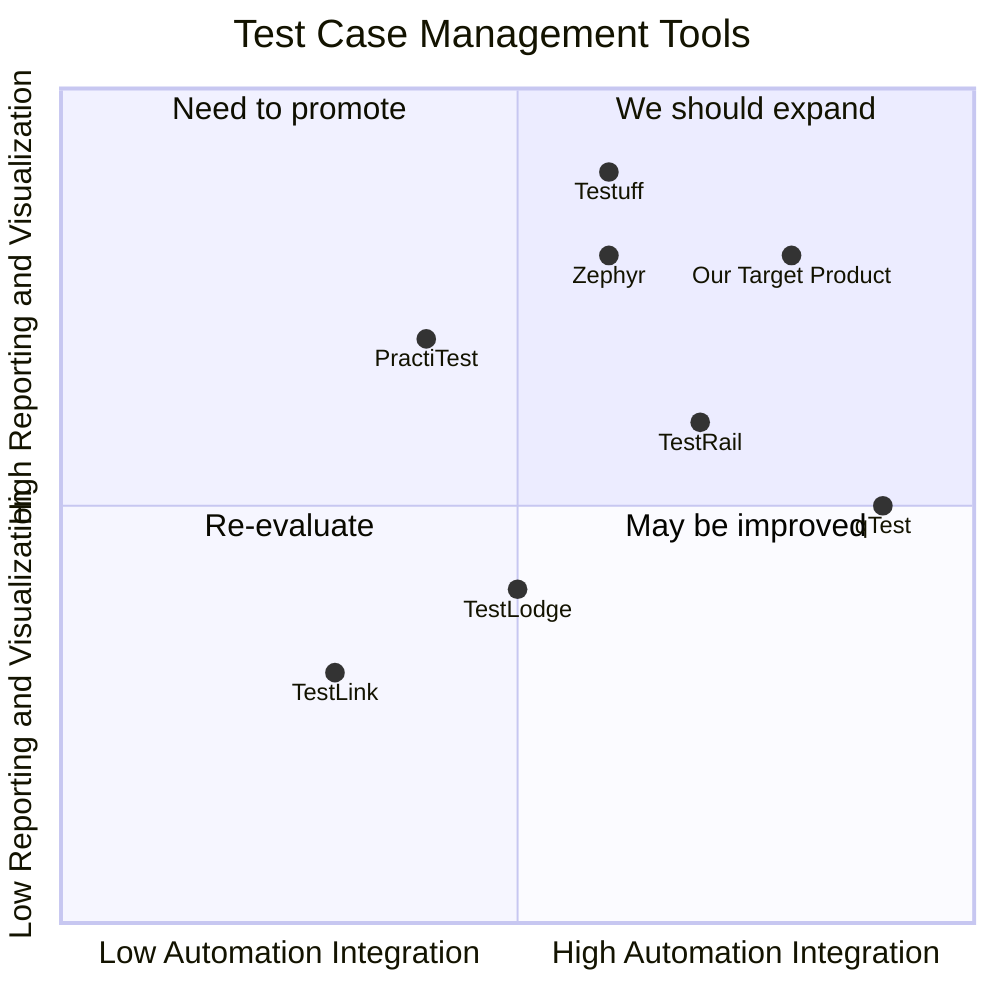

## Original Requirements
The boss has asked for a test case management tool that can accept automation executions for reporting, metrics, and visualization.

## Product Goals
```python
[
    "Create a test case management tool that can integrate with automation tools",
    "Provide detailed reporting and metrics for test case executions",
    "Visualize test case execution data in an intuitive and user-friendly manner"
]
```

## User Stories
```python
[
    "As a QA engineer, I want to be able to upload my automated test results so that they can be tracked and managed",
    "As a QA manager, I want to see detailed reports of test executions so that I can measure the effectiveness of our testing",
    "As a product manager, I want to see visualizations of test case executions so that I can understand the overall quality of our product",
    "As a developer, I want to see the results of automated tests so that I can fix any issues quickly",
    "As a stakeholder, I want to see the overall health of the product through test case execution metrics so that I can make informed decisions"
]
```

## Competitive Analysis
```python
[
    "TestRail: Provides comprehensive test case management but lacks in detailed visualization",
    "Zephyr: Offers robust reporting and metrics but has a steep learning curve",
    "qTest: Strong in integration with automation tools but the user interface is not intuitive",
    "PractiTest: Excellent for manual testing management but lacks in automation integration",
    "TestLodge: Simple and easy to use but lacks in-depth reporting and metrics",
    "TestLink: Open-source and customizable but lacks in user-friendliness and modern features",
    "Testuff: Strong in reporting and metrics but lacks in automation integration"
]
```

## Competitive Quadrant Chart


## Requirement Analysis
The product should be a test case management tool that can integrate with automation tools for test case execution. It should provide detailed reporting and metrics for these executions and visualize the data in an intuitive manner.

## Requirement Pool
```python
[
    ("Integration with automation tools for test case execution", "P0"),
    ("Detailed reporting and metrics for test case executions", "P0"),
    ("Visualization of test case execution data", "P0"),
    ("User-friendly interface for easy navigation and usage", "P1"),
    ("Ability to upload and manage test cases", "P1")
]
```

## UI Design draft
The user interface should be clean and intuitive. The main dashboard should display a summary of the test case executions, including pass/fail rates, trends over time, and any outstanding issues. There should be a navigation bar on the left side for users to access different sections like test case management, reports, and settings. The color scheme should be neutral and professional.

## Anything UNCLEAR
There are no unclear points.