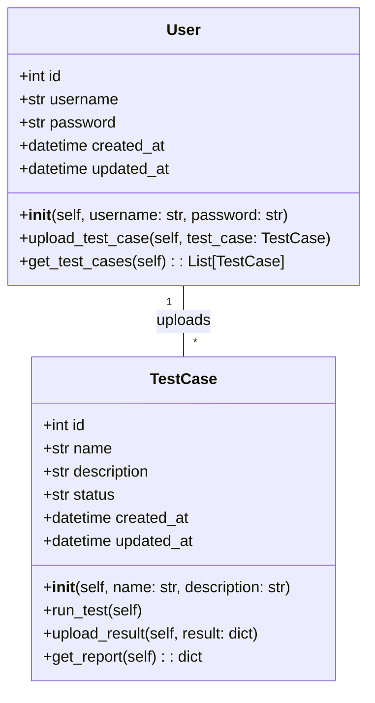
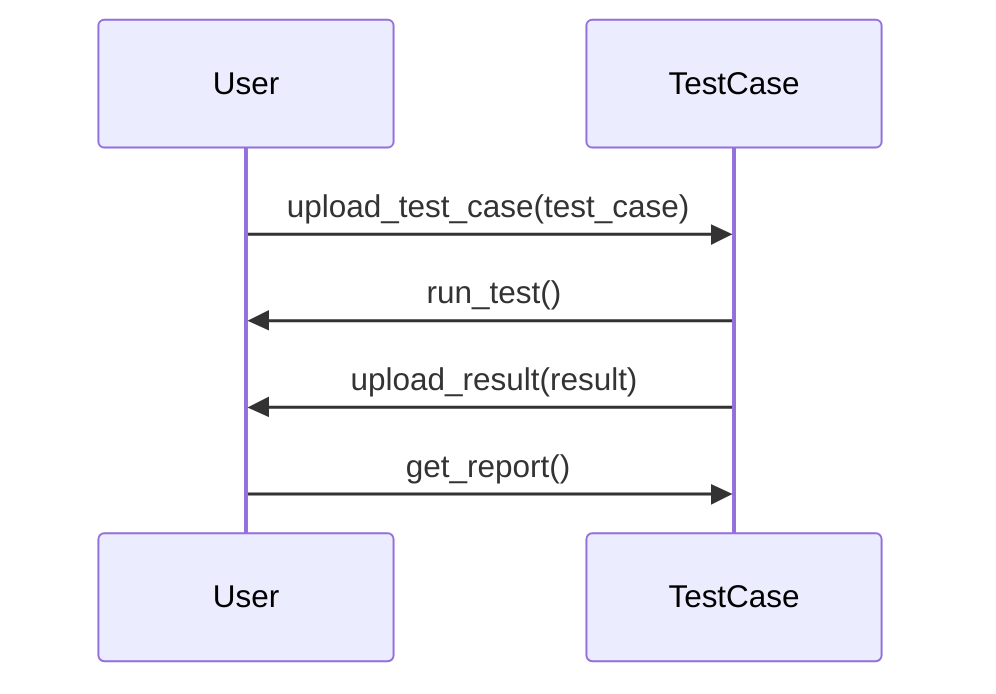

## Implementation approach
To implement this test case management system, we will use Flask as our web framework due to its simplicity and flexibility. For the database, we will use SQLAlchemy which is a Python SQL toolkit and ORM that provides a full suite of well-known enterprise-level persistence patterns. We will use Pytest for running the tests and generating reports. For visualization, we will use Matplotlib and Seaborn libraries. For automation integration, we will use Selenium WebDriver. 

## Python package name
```python
"test_case_manager"
```

## File list
```python
[
    "main.py",
    "models.py",
    "views.py",
    "tests.py",
    "utils.py",
    "templates/index.html",
    "templates/report.html",
    "templates/visualize.html",
    "static/css/main.css",
    "static/js/main.js"
]
```

## Data structures and interface definitions


## Program call flow


## Anything UNCLEAR
The requirement is clear to me.